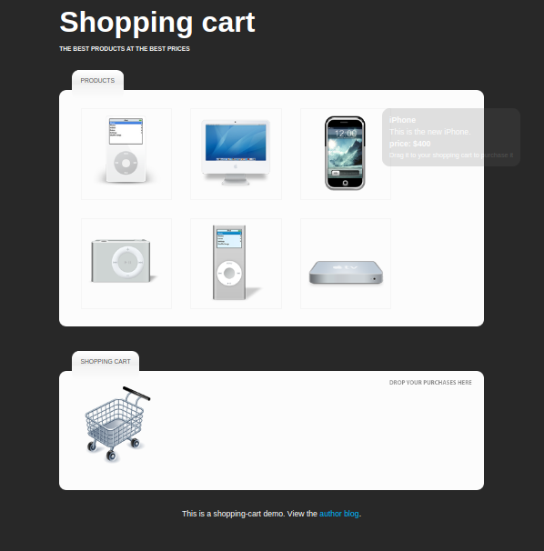

# Shopping cart

### Introduction
In this repository we are going to create an AJAX-driven shopping cart. All the products are going to be stored in a MySQL database, with PHP showing and processing the data.

jQuery will drive the AJAX-es on the page, and with the help of the simpletip plugin will add to an interactive check out process.

### Set up the demo 
If you want to set up a working demo, you'll need to execute the following SQL code in your database manager (e.g. phpMyAdmin). It will set up the table and insert a few products. The code is also available in table.sql in the demo files.

After this, you should fill in your MySQL credentials in connect.php.example and rename it in connect.php

## Authors
Made with ❤️ by [Sergio Casizzone](https://sergiocasizzone.altervista.org)
